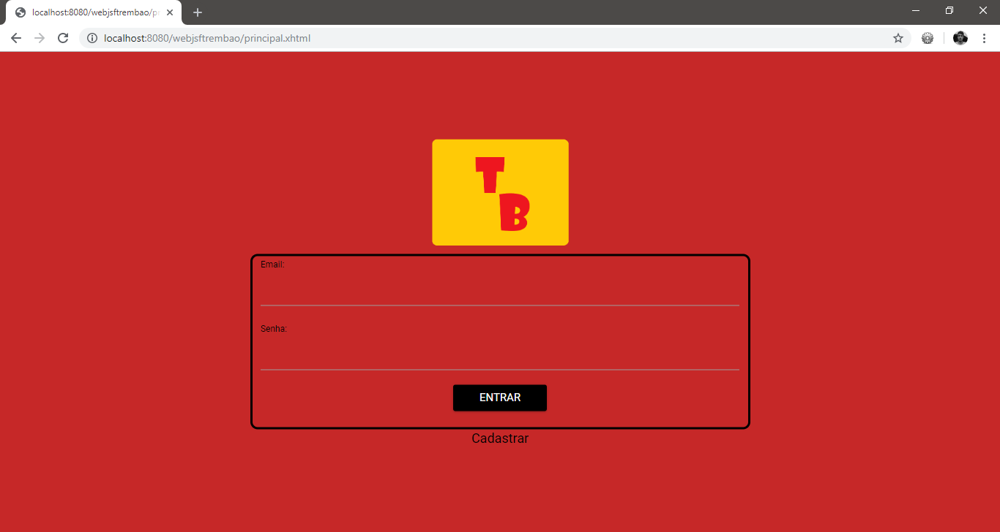
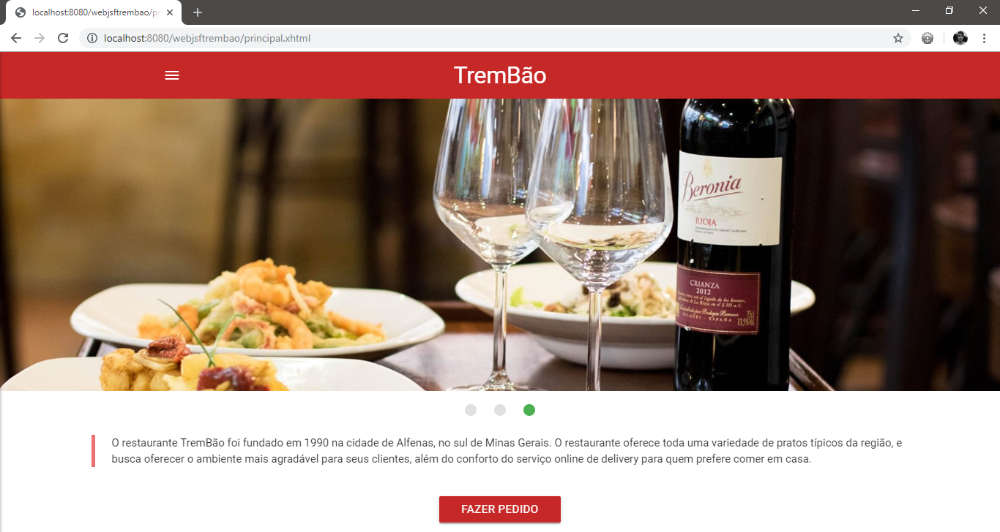
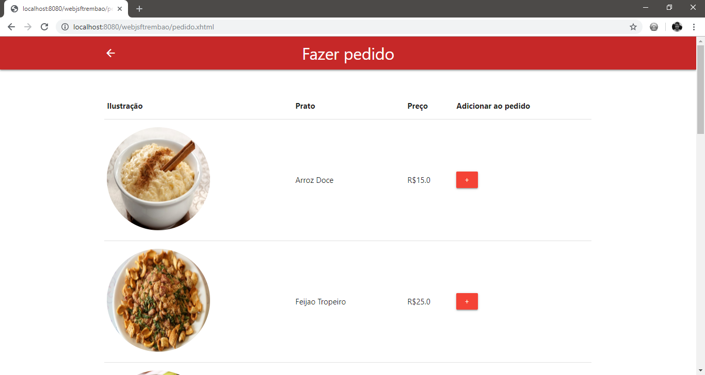

# JavaServer Faces: Projeto restaurante TremBão

  Trabalho proposto pelo professor Maurício na disciplina de Linguagens e Técnicas de Programação III(6º Período) do curso de Ciência da Computação, cujo objetivo fora desenvolver um site que cumpra com a função essencial de um estabelecimento.
  
  O presente projeto foi pensado para cumprir a necessidade de gerenciamento de pedidos de um restaurante de pequeno porte de uma cidade do interior. Tal necessidade inclui efetuamento e cancelamento de pedidos online. 
  
  Para o desenvolvimento do mesmo, foram utilizadas a API JPA(Java Persistence API) 2.1 juntamente com a especificação JavaServer Faces  2.2 e o framework Hibernate 5.2.16.Final para fazer o mapeamento Objeto-Relacional, isto é, modelar o banco de dados de acordo com o modelo do nosso projeto. Além disso, foram utilizados o MySQL 5.7.17 e a API Javax Servlets 3.0.1 para criação das servlets que vão gerenciar as requisições e gerar views para o usuário.
  
  Além das tecnologias acima citadas, no front-end foram utilizados o Materialize Framework(v.0.100.2 e v1.0.0) , JQuery 2.1.1 e o PrimeFaces 6.2 para o desenvolvimento de recursos de interface gráfica.

#### ATENÇÃO: NÃO POSSUÍMOS QUAISQUER DIREITOS AUTORAIS SOBRE AS IMAGENS UTILIZADAS NESTE PROJETO, TODAS ELAS FORAM UTILIZADAS COM O ÚNICO PROPÓSITO DE ESTUDO. 

#### NOTAS:

* Certifique-se de que os plug-ins e dependências do Maven realmente correspondem às versões de software instaladas na sua máquina.

* O projeto acompanha o script de criação do banco de dados e inserção de seus dados. Atente-se à versão do MySQL para evitar problemas de incompatibilidade. 

##### Outros desenvolvedores: Diogo Machado Miranda e Willian Pereira Mariano

#### Capturas de tela: 

